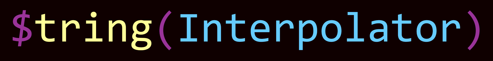

<!-- PROJECT SHIELDS -->
[![Contributors][contributors-shield]][contributors-url]
[![Forks][forks-shield]][forks-url]
[![Stargazers][stars-shield]][stars-url]
[![Issues][issues-shield]][issues-url]
[![MIT License][license-shield]][license-url]


<!-- PROJECT LOGO -->
<br />
<div align="center">
  <a href="https://github.com/JaielZeus/StringInterpolator">
    
  </a>
  <p align="center">
    <b>🔥🎉🔥 String Interpolator - An easy-to-use string interpolation tool for your Node.js projects 🔥🎉🔥</b>
    <br />
    <br />
    <a href="https://github.com/JaielZeus/StringInterpolator/issues/new">Report Bug 🪳</a>
    ·
    <a href="https://github.com/JaielZeus/StringInterpolator/issues/new">Request Feature 🔧</a>
  </p>
</div>


<!-- TABLE OF CONTENTS -->
<details>
  <summary>Table of Contents</summary>
  <ol>
    <li>
      <a href="#-about-the-project">About The Project</a>
    </li>
    <li>
      <a href="#-getting-started">Getting Started</a>
      <ul>
        <li><a href="#%EF%B8%8F-prerequisites">Prerequisites</a></li>
        <li><a href="#-installation">Installation</a></li>
      </ul>
    </li>
    <li>
      <a href="#%EF%B8%8F-usage">Usage</a>
      <ul>
        <li><a href="#instantiation">Instantiation</a></li>
        <li><a href="#adding-variables">Adding variables</a></li>
        <li><a href="#adding-functions">Adding functions</a></li>
        <li><a href="#providing-literals-as-callbacks">Providing literals as callbacks</a></li>
        <li><a href="#marker-and-delimiters">Marker and Delimiters</a></li>
        <li><a href="#options">Options</a></li>
        <li><a href="#interpolating">Interpolating</a></li>
      </ul>
    </li>
    <li>
      <a href="#-examples">Examples</a>
      <ul>
        <li><a href="#example-1---variable">Example 1 - Variable</a></li>
        <li><a href="#example-2---variable--function">Example 2 - Variable + Function</a></li>
        <li><a href="#example-3---intermediate">Example 3 - Intermediate</a></li>
      </ul>
    </li>
    <li><a href="#-roadmap">Roadmap</a></li>
    <li><a href="#-contributing">Contributing</a></li>
    <li><a href="#%EF%B8%8F-license">License</a></li>
    <li><a href="#-contact">Contact</a></li>
  </ol>
</details>

<!-- ABOUT THE PROJECT -->
## 🔎 About The Project

This project aims to provide developers with a simple tool for interpolating text via `variables` and (text-processing) `functions` in their Node.js projects. The need for such a feature naturally arises when dealing with (user-provided) texts that need to be interpolated with data.

-> Check out <a href="#%EF%B8%8F-usage">🛠️ Usage</a> for the key concepts and <a href="#-examples">📖 Examples</a> for some cool examples! 

**Features**:
 - Blazingly fast! 🔥
 - Recursive interpolation ♾️
 - Unlimited power 💯


<!-- GETTING STARTED -->
## 🚀 Getting Started

To get started simply fulfill the prerequistes, install the package via npm and use it in your code.

### ⚠️ Prerequisites

If not present on your development environment simply download the latest Node.js + npm version [here](https://nodejs.org/en/download).

*Minimum versions required:*
```
$ npm -v
6.1.12
```
```
$ node -v
v12.13.0
```

### 💾 Installation

Install the [package via npm](https://www.npmjs.com/package/@jaielzeus/stringinterpolator) with he following command:

```
$ npm i @jaielzeus/stringinterpolator
```

<!-- USAGE -->
## 🛠️ Usage

Here are the key concepts of how to use the `StringInterpolator` in your code.

### **Instantiation**
Simply require the package and instantiate an object:
```
const StringInterpolator = require('@jaielzeus/stringinterpolator');

const interpolator = new StringInterpolator();
```

### **Adding variables**
Add a `variable` and a `callback` function. The `callback` will be called with the provided `data` object when the token for the `variable` is replaced in the text. A `callback` function has to provide either a `boolean`, a `number` or a `string`.
```
interpolator.addVariable('name', (d) => d.name);
```

### **Adding functions**
Add a `function` and a `callback` function. The `callback` will be called with the provided `data` object and the `content` inbetween the `delimiters` when the token for the `function` is replaced in the text. A `callback` function has to provide either a `boolean`, a `number` or a `string`.
```
interpolator.addFunction('max', (d, c) => Math.max(...c.split(',')));
```

### **Providing literals as callbacks**
Interpolation `variables` or `functions` can also take literals as `callbacks` (Although not so useful for `functions`).  The literals can be a `boolean`, a `number` or a `string`.
```
interpolator.addVariable('name', 'JaielZeus');
interpolator.addFunction('year', 2023);
```

### **Marker and Delimiters**
Interpolation `variables` and `functions` have a pre-defined `marker` (default: '$') in front of them for identification.
```
"This is a $variable this is a $function()"
```
Additionally `functions` have a `content` that is surrounded by the `delimiters`(default: '()').
```
"This is a $function(with content inside)"
```
A `function`'s registered `callback` will be called like a `variable` with the provided `data` object but also with the `content` that is inside of the `delimiters`.

If you want to escape `markers` and `delimiters` in texts you can do that by simply escaping them with a single "`\`" in front of them:
```
interpolator.addFunction('escapedfunction', "not!");

// "This is an $escapedfunction() and this is not!"
interpolator.process("This is an \$escapedfunction() and this is $escapedfunction(), {})"
```

 You can adjust `markers` and `delimiters` via the `options` when instantiating a `StringInterpolator` object

### **Options**
`StringInterpolator` objects can be instantiated with different `options`:
```
const interpolator = new StringInterpolator({
    maxDepth: 10,
    marker: '$',
    delimiters: '()',
    log: false,
});
```
- **maxDepth**: Maximum recursion depth
    - Range: 1 - 50
    - Default: 10
- **marker**: The marker used to identify interpolation `variables` and `functions`
    - Possible: '$', '?', '!', '/', '&', '#', '@', '+', '*', '§', '%'
    - Default: '$'
- **delimiters**: The left and right delimiters for `functions`
    - Possible: '()', '[]', '{}', '<>'
    - Default: '()'
- **log**: If error logging should be activated, logs failed interpolation attempts
    - Default: false

### **Interpolating**
After a `StringInterpolator` object is set up with `variables` and `functions` you can start interpolating text by calling the `process()` method and providing the `text` and `data` object.
```
const interpolator = new StringInterpolator();

// Add variables and functions...

const data = {
  some: 'data',
};

const text = 'Some text...';

const result = interpolator.process(text, data);

console.log(result);
```

<!-- USAGE EXAMPLES -->
## 📖 Examples
Here are some simple to intermediate examples

### **Example 1** - Variable
```
const StringInterpolator = require('@jaielzeus/stringinterpolator');

const interpolator = new StringInterpolator();

interpolator.addVariable('name', (d) => d.name);

const data = {
  name: 'JaielZeus',
};

// "Your name is JaielZeus!"
console.log(interpolator.process('Your name is $name!', data));
```

### **Example 2** - Variable + Function
```
const StringInterpolator = require('@jaielzeus/stringinterpolator');

const interpolator = new StringInterpolator();

interpolator.addVariable('a', (d) => d.a);
interpolator.addVariable('b', (d) => d.b);

interpolator.addFunction('max', (d, c) => Math.max(...c.split(',')));

const data = {
  a: 10,
  b: 20,
};

const string = 'The maximum of a=$a and b=$b is $max($a,$b)!';

// "The maximum of a=10 and b=20 is 20!"
console.log(interpolator.process(string, data));
```

### **Example 3** - Intermediate
```
const StringInterpolator = require('@jaielzeus/stringinterpolator');

const interpolator = new StringInterpolator();

interpolator.addVariable('name', (d) => d.name);
interpolator.addVariable('id', (d) => d.id);
interpolator.addVariable('adminId', (d) => d.adminId);
interpolator.addVariable('year', 2023);
interpolator.addVariable('greeting', 'Greetings, $name!');

interpolator.addFunction('if', (d, c) => {
  const [condition, _if = '', _else = ''] = c.split(';');
  return String(condition).trim() === 'true' ? _if : _else;
});

interpolator.addFunction('equal', (d, c) => {
  const [a, b] = c.split(',');
  return a === b;
});

interpolator.addFunction('authorize', (d) => d.id === d.adminId);

const adminId = 100;

const adminData = {
  name: 'JaielZeus',
  id: 100,
};

const userdata = {
  name: 'RandomGuy',
  id: 999,
};

const string = '$greeting You $if($authorize();are;are not) authorized and $if($equal($id,$adminId);can;cannot) enter!';

// "Greetings, JaielZeus! You are authorized and can enter!"
console.log(interpolator.process(string, { ...adminData, adminId }));

// "Greetings, RandomGuy! You are not authorized and cannot enter!"
console.log(interpolator.process(string, { ...userdata, adminId }));
```

<!-- ROADMAP -->
## 🚗 Roadmap

- ✅ Initial push
- ❌ Possibility to add regex instead of names for variables and functions maybe
- ❌ Optional default functions
- ❌ Tests
- ❌ Wiki with more examples

See the [open issues](https://github.com/JaielZeus/StringInterpolator/issues) for a full list of proposed features (and known issues).

<!-- CONTRIBUTING -->
## 🫵 Contributing

Contributions are **greatly appreciated**. You can either [open an issue](https://github.com/JaielZeus/StringInterpolator/issues/new) with the tag "enhancement" or contribute your own code:

1. [Fork](https://github.com/JaielZeus/StringInterpolator/fork) the Project
2. Create your Feature Branch
    ```
    $ git checkout -b feature/featurename
    ```
3. Commit your Changes
    ```
    $ git commit -m 'Add some featurename'
    ```
4. Push to the Branch
    ```
    $ git push origin feature/featurename
    ```
5. Open a [Pull Request](https://github.com/JaielZeus/StringInterpolator/pulls)

<!-- LICENSE -->
## ©️ License

Distributed under the MIT License. See [LICENSE](https://github.com/JaielZeus/StringInterpolator/blob/main/LICENSE) for more information.

<!-- CONTACT -->
## 📫 Contact

JaielZeus 
- Twitter: [@jaielzeus](https://twitter.com/jaielzeus)
- Discord: [Jaiel#7517](https://discord.com/users/441400034672640000)
- Email: jaielzeus@gmail.com

<!-- MARKDOWN LINKS & IMAGES -->
[contributors-shield]: https://img.shields.io/github/contributors/JaielZeus/StringInterpolator.svg?style=for-the-badge
[contributors-url]: https://github.com/JaielZeus/StringInterpolator/graphs/contributors
[forks-shield]: https://img.shields.io/github/forks/JaielZeus/StringInterpolator.svg?style=for-the-badge
[forks-url]: https://github.com/JaielZeus/StringInterpolator/network/members
[stars-shield]: https://img.shields.io/github/stars/JaielZeus/StringInterpolator.svg?style=for-the-badge
[stars-url]: https://github.com/JaielZeus/StringInterpolator/stargazers
[issues-shield]: https://img.shields.io/github/issues/JaielZeus/StringInterpolator.svg?style=for-the-badge
[issues-url]: https://github.com/JaielZeus/StringInterpolator/issues
[license-shield]: https://img.shields.io/github/license/JaielZeus/StringInterpolator.svg?style=for-the-badge
[license-url]: https://github.com/JaielZeus/StringInterpolator/blob/main/LICENSE
[product-screenshot]: images/screenshot.png